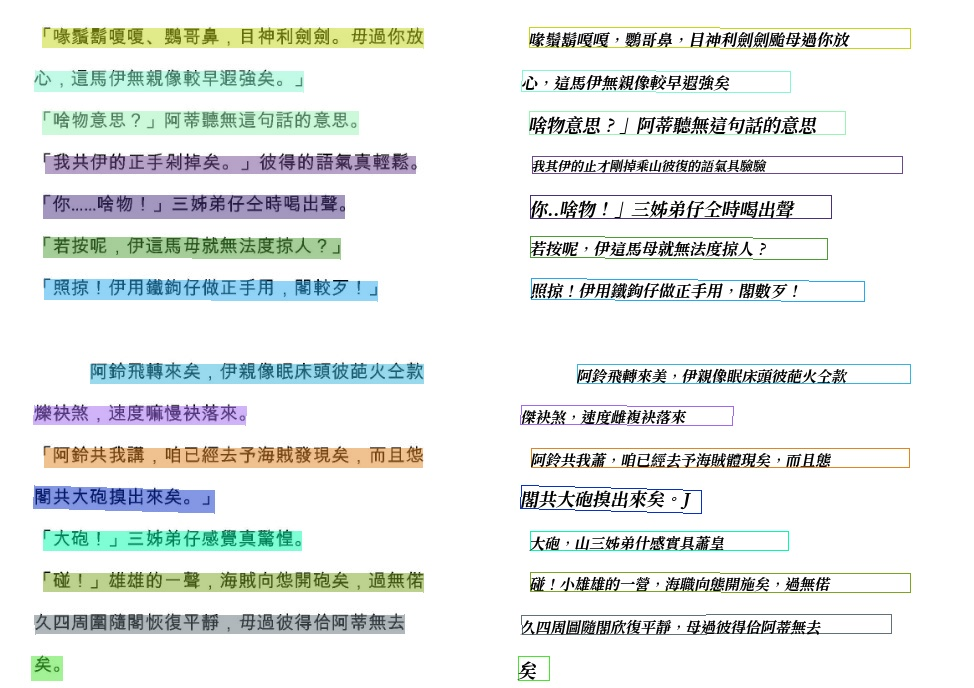
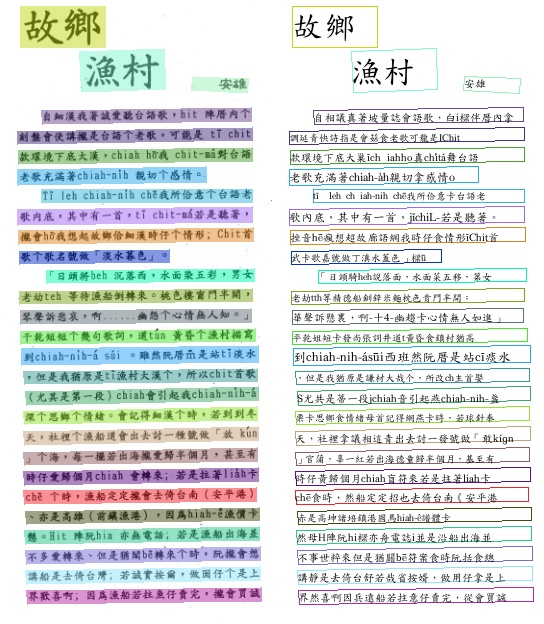
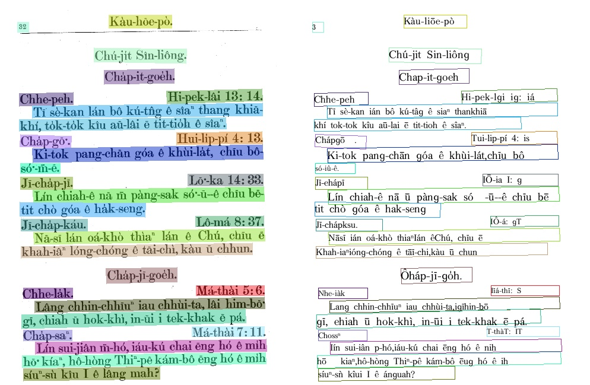

# 主要功能

辨識漢羅台文、白話字、全羅等等圖片文字並儲存成 PDF 檔








# 安裝環境

下載 repository

```
git clone https://github.com/leon0719/taigiOCR.git
```

利用 Docker image 來建立環境，安裝函式庫 、 CUDA 及 CUDA Toolkit

```
#建立 資料夾儲存圖片
mkdir img_data

docker run --gpus all -it --name OCR_ENV -v /path/to/taigiOCR:/workspace/ -v /path/to/img_data:/train_data/ --shm-size=120g --ulimit memlock=-1 leonhilty/ocr_search:v1.0.6 /bin/bash

```

確認進入 Docker 環境


## 產生 DATASET

使用 tools/train_test_split.py 生成 中、英、日、白話字、漢羅、台羅等文字圖片並切割訓練(90%)驗證(10%)，
與模擬的測試資料

```
cd tools/
python train_test_split.py
```

生成結果


訓練集與驗證集

|          | 訓練集       | 驗證集      |
| -------- | ------------ | ----------- |
| 中       | 360,000      | 40,000      |
| 英       | 360,000      | 40,000      |
| 日       | 360,000      | 40,000      |
| 白話字   | 360,000      | 40,000      |
| 台羅     | 360,000      | 40,000      |
| 漢羅     | 360,000      | 40,000      |
| 總共(張) | 2,160,000    | 240,000     |
| 字元數   | 100,000,000+ | 17,000,000+ |

資料夾樹狀圖

```
/train_data/
    (模擬測試資料)
    ├── test_ch
    ├── test_en
    ├── test_HAN_LO
    ├── test_jp
    ├── test_POJ
    ├── test_TAI_LO
    └── train_data
        ├── test (驗證集 Img)
        ├── test_label.txt (驗證集 Label)
        ├── train (訓練集 Img)
        └── train_label.txt (訓練集 Label)
```

## 如何訓練

修改 PaddleOCR/configs/rec/PP-OCRv3/PP-OCRv3_rec.yml 設定檔

|                         | 修改為                                                                                |
| ----------------------- | ------------------------------------------------------------------------------------- |
| num_workers             | GPU 個數                                                                              |
| character_dict_path     | 自定義字典路徑 e.x. ppocr/utils/dict/total_dic.txt                                    |
| Architecture-Algorithm: | SVTR、PREN、Rosetta、RARE、STARNet、SRN、NRTR、CRNN、SEED、SAR                        |
| Architecture-Backbone:  | MobileNetV1Enhance、EfficientNetb3_PREN、MobileNetV3、SVTRNet、ResNetFPN、MTB、ResNet |

修改後即可開始訓練

```
cd PaddleOCR
# 需修改 train.sh --gpus 參數 e.x. 3張GPU --gpus '0,1,2'
sh train.sh
```

若暫時中斷訓練想繼續訓練可使用 re-train.sh 恢復訓練

```
cd PaddleOCR
# 需修改 re-train.sh --gpus 參數
sh re-train.sh
```

訓練完成後在 output 目錄下會有保存後的模型與訓練目錄

```
my_ocr_model/
├── best_accuracy.pdopt
├── best_accuracy.pdparams
├── best_accuracy.states
├── config.yml
├── latest.pdopt
├── latest.pdparams
├── latest.states
└── train.log
```

## 各個語言預測結果

使用 tools/test_data_predict.py 對**模擬的測試圖片資料**進行預測並計算 CER

```
cd tools/
python test_data_predict.py
```

預測結果保存在 PaddleOCR/result 中

## 預測結果 (CER)

所使用 Algorithm : **SVTR** Backbone : **MobileNetV1Enhance**

|        | 中     | 英     | 日     | 白話字 | 漢羅   | 台羅   |
| ------ | ------ | ------ | ------ | ------ | ------ | ------ |
| CER(%) | 3.949% | 0.166% | 2.150% | 2.350% | 1.908% | 0.277% |
| 字元數 | 119575 | 373564 | 207048 | 300592 | 85656  | 356497 |

## 應用

將訓練好的**文字辨認**模型轉換成推理模型

```
cd PaddleOCR
python3 tools/export_model.py -c configs/rec/PP-OCRv3/PP-OCRv3_rec.yml -o Global.pretrained_model=output/my_ocr_model/best_accuracy  Global.save_inference_dir=./rec_inference/
```

轉換過後會在 PaddleOCR/rec_inference 目錄下
資料夾樹狀圖

```
rec_inference/
├── inference.pdiparams
├── inference.pdiparams.info
└── inference.pdmodel
```

## 如何預測整張圖片 (文字偵測模型+文字辨認模型)

使用 PaddleOCR/tools/infer/predict_system.py 對圖片進行預測

```
#選擇想要預測的圖片路徑 --image_dir
#字型路徑 --vis_font_path
cd PaddleOCR
python tools/infer/predict_system.py --det_model_dir="./det_inference" --rec_model_dir="./rec_inference" --rec_char_dict_path=./ppocr/utils/dict/total_dic.txt --vis_font_path=./test/font/ch_en.ttf --image_dir=./test/test_ch/ch.jpg
```

預測結果會存在 PaddleOCR/inference_results 目錄下

## Reference

[1] [Paddleocr](https://github.com/PaddlePaddle/PaddleOCR)

[2] [Textrecognitiondatagenerator](https://github.com/Belval/TextRecognitionDataGenerator)
