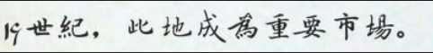
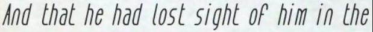
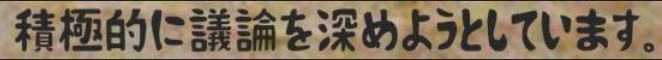
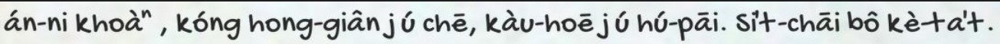
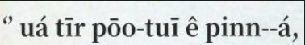
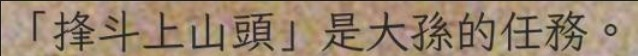

# OCR 操作流程

如何利用 OCR 辨識漢羅台文、白話字、全羅等等語言

## 安裝環境

下載 repository

```
git clone https://github.com/leon0719/OCR.git
```

利用 Docker image 來建立環境，安裝對應的 CUDA 及 CUDA Toolkit

```
docker run --gpus all -it --name OCR_ENV -v /path/to/OCR/:/workspace/ -v /path/to/img_data/:/train_data/ --shm-size=120g --ulimit memlock=-1 leonhilty/ocr_search:v1.0.6 /bin/bash
```

確認進入 Docker 環境


## 產生 DATASET

使用 tools/train_test_split.py 生成 中、英、日、白話字、漢羅、台羅等文字圖片並切割訓練(90%)驗證(10%)，
與模擬的測試資料

```
cd tools/
python3 python train_test_split.py
```

生成結果








訓練集與驗證集

| 語言   | 訓練集 | 驗證集 | 總共  |
| ------ | ------ | ------ | ----- |
| 中     | 9000   | 1000   | 10000 |
| 英     | 9000   | 1000   | 10000 |
| 日     | 9000   | 1000   | 10000 |
| 白話字 | 9000   | 1000   | 10000 |
| 台羅   | 9000   | 1000   | 10000 |
| 漢羅   | 9000   | 1000   | 10000 |

資料夾樹狀圖

```
/train_data/
    (模擬測試資料)
    ├── test_ch
    ├── test_en
    ├── test_HAN_LO
    ├── test_jp
    ├── test_POJ
    ├── test_TAI_LO
    └── train_data
        ├── test (驗證集 Img)
        ├── test_label.txt (驗證集 Label)
        ├── train (訓練集 Img)
        └── train_label.txt (訓練集 Label)
```

## 如何訓練

修改 PaddleOCR/configs/rec/PP-OCRv3/PP-OCRv3_rec.yml 設定檔

|                         | 修改為                                                                                |
| ----------------------- | ------------------------------------------------------------------------------------- |
| num_workers             | GPU 個數                                                                              |
| character_dict_path     | 字典路徑 e.x. ppocr/utils/dict/total_dic.txt                                          |
| Architecture-algorithm: | SVTR、PREN、Rosetta、RARE、STARNet、SRN、NRTR、CRNN、SEED、SAR                        |
| Architecture-Backbone:  | MobileNetV1Enhance、EfficientNetb3_PREN、MobileNetV3、SVTRNet、ResNetFPN、MTB、ResNet |

修改後即可開始訓練

```
cd PaddleOCR
sh train.sh
```
